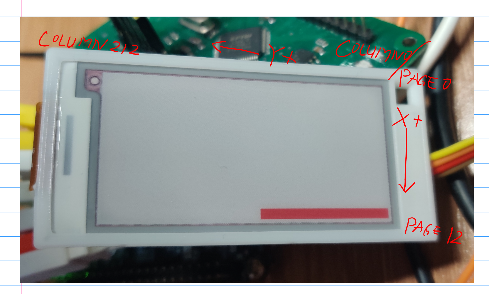

# Driver library for DKE Group 2.13" EPD

## Supported model:
* `DKE DEPG0213RHS75AF1CP`

## Usage Example:

Config initialization:

```C
  depg0213_epd_t epd = {
    .user_data = &hspi2,
    .cb = {
      .reset_cb = _epd_reset_cb,
      .poll_busy_cb = _epd_poll_busy,
      .write_cmd_cb = _epd_write_cmd_cb,
      .write_data_cb = _epd_write_data_cb
    }
  };

  depg0213_epd_init(&epd);
```

Callbacks:

```C
depg0213_ret_t _epd_reset_cb(void *handle) {
  // Implement your hard reset function here, 
  // RESET pin needs to be pulled low for at least 200us.
  return DEPG0213_OK;
}

depg0213_ret_t _epd_poll_busy(void *handle) {
  // Return DEPG0213_ERROR if timeout or error occurred.
  // Implement your GPIO read function here.
  return DEPG0213_OK;
}

depg0213_ret_t _epd_write_cmd_cb(void *handle, uint8_t *cmd, uint8_t len) {
  // handle is the user pointer
  // The first byte of the command need to set D/CX to low,
  // while the rest of the command parameters requires D/CX to be high.
  // Implement your SPI transmit function here.
  return DEPG0213_OK;
}

depg0213_ret_t _epd_write_data_cb(void *handle, uint8_t *data, uint16_t len) {
  // handle is the user pointer
  // Set D/CX to high while transmitting data.
  // Implement your SPI transmit function here.
  return DEPG0213_OK;
}

```

## Notes:

Pixels of this panel is organized in the similar way as SSD1306, but has 212 columns and 13 pages.  
Therefore, when `HORIZONTAL` or `HORIZONTAL_INVERSE` modes are selected, the frame needs to be  
transferred as pages. However, this controller chip has the function which can change the  
self-increment direction of the internal pointer, so `VERTICAL` modes are not affected anyway. 

